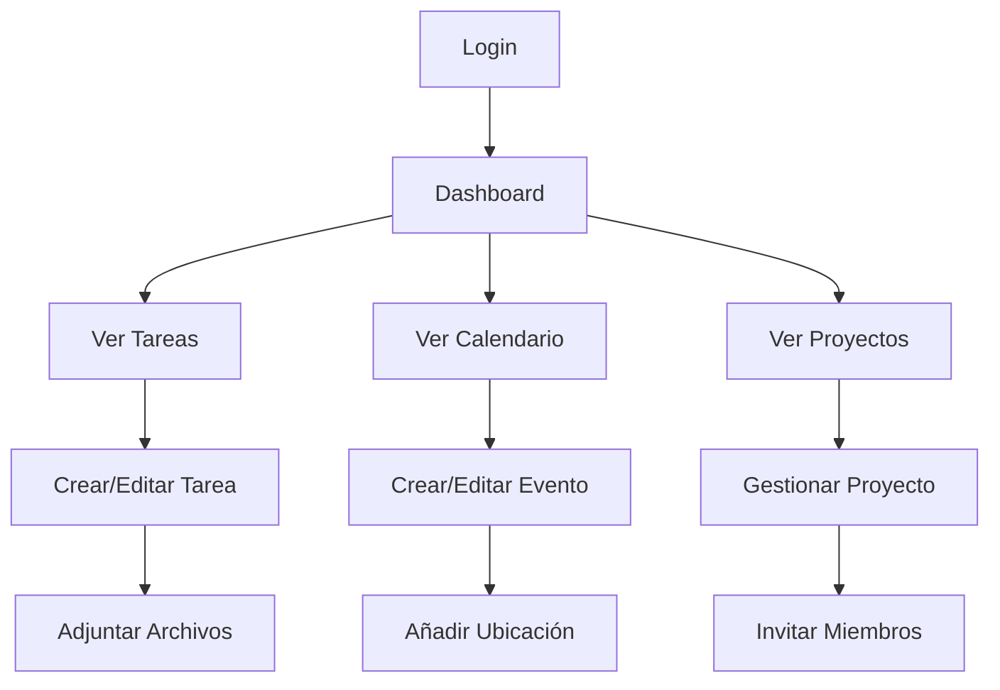

# Propuesta de Proyecto Intermodular
## FlowBoard - Gestión Colaborativa de Tareas y Eventos

**Curso:** 2º Desarrollo de Aplicaciones Multiplataforma  
**Fecha:** Septiembre 2025 
**Autor:** Pau López Núñez

---

## 📋 1. Resumen Ejecutivo

**FlowBoard** es una aplicación móvil multiplataforma de gestión colaborativa de tareas y eventos, diseñada específicamente para estudiantes universitarios y equipos pequeños. La solución combina funcionalidades de organización personal con herramientas colaborativas, permitiendo una gestión eficiente tanto offline como online con sincronización automática.

### 🎯 Objetivo Principal
Mejorar la productividad académica y organizacional mediante una herramienta digital intuitiva que facilite la colaboración, seguimiento de tareas y gestión temporal para estudiantes y equipos de trabajo.

### 🌍 Impacto Social y Sostenibilidad
- **ODS 4 - Educación de Calidad**: Mejora la organización y rendimiento académico de estudiantes
- **ODS 8 - Trabajo Decente**: Optimiza la productividad de equipos pequeños y startups
- **Sostenibilidad Digital**: Arquitectura eficiente, bajo consumo energético, diseño accesible

---

## 🎯 2. Justificación del Proyecto

### 2.1 Problemática Identificada
- **Dispersión de herramientas**: Los estudiantes usan múltiples apps (calendarios, notas, chat) sin integración
- **Falta de colaboración efectiva**: Dificultad para coordinar proyectos grupales académicos
- **Pérdida de información**: Ausencia de sincronización entre dispositivos y miembros del equipo
- **Baja productividad**: Falta de métricas y seguimiento del progreso académico

### 2.2 Solución Propuesta
FlowBoard centraliza la gestión de tareas académicas y proyectos colaborativos en una única plataforma que funciona tanto online como offline, con sincronización automática y herramientas de análisis de productividad.

### 2.3 Público Objetivo
- **Estudiantes universitarios** (individual y grupal)
- **Equipos de proyectos académicos**
- **Pequeñas organizaciones estudiantiles**
- **Startups y equipos de trabajo ágiles**

---

## ✅ 3. Cumplimiento de Requisitos del Proyecto Intermodular

A continuación se detalla cómo FlowBoard cumple **exhaustivamente** todos los requisitos mínimos establecidos para el proyecto intermodular:

### 📊 Tabla Resumen de Cumplimiento

| **Módulo** | **Requisito** | **Cumplimiento** | **Evidencia** |
|-----------|---------------|------------------|---------------|
| **Acceso a Datos** | Base de datos con 3-4 tablas relacionadas | ✅ Cumple | 4 tablas: Users, Projects, Tasks, Incidents |
| | Operaciones CRUD completas | ✅ Cumple | CRUD para todas las entidades |
| | Import/Export JSON o XML | ✅ Cumple | JSON, XML y CSV |
| **Desarrollo de Interfaces** | GUI clara, usable y accesible | ✅ Cumple | Material 3 + WCAG 2.1 |
| | Formularios y menús con validación | ✅ Cumple | Validación en tiempo real |
| | Informe con gráficos | ✅ Cumple | Dashboard con charts |
| **Programación Multimedia** | Ejecutable en PC y móvil | ✅ Cumple | Android + Desktop (Compose MP) |
| | Funcionalidades multimedia | ✅ Cumple | Imágenes, PDF, mapas |
| | Soporte HTTPS | ✅ Cumple | API REST con SSL/TLS |
| **Servicios y Procesos** | Servicio en red (API REST) | ✅ Cumple | API REST completa |
| | Gestión de hilos/procesos | ✅ Cumple | Coroutines + WorkManager |
| | Seguridad (roles, cifrado) | ✅ Cumple | JWT + BCrypt + HTTPS |
| **Gestión Empresarial** | Control de usuarios/clientes | ✅ Cumple | Sistema de usuarios completo |
| | Gestión de incidencias | ✅ Cumple | Sistema de tickets |
| | Informes de actividad | ✅ Cumple | Analytics y reportes |
| | Panel de control (dashboard) | ✅ Cumple | Dashboard administrativo |
| **Sostenibilidad** | Vinculado a ODS | ✅ Cumple | ODS 4, 8, 12, 13 |
| | Principios de sostenibilidad | ✅ Cumple | Eficiencia, accesibilidad |
| | Medidas sostenibles | ✅ Cumple | Reducción papel, optimización |

---

## 🔧 4. Integración de Módulos DAM

### 4.1 Acceso a Datos ✅

#### **Base de Datos Relacional**
```sql
-- 4 Tablas principales relacionadas
Users (id, email, username, fullName, role, createdAt)
Projects (id, name, description, ownerId, members, deadline)
Tasks (id, title, description, projectId, assignedTo, dueDate, priority)
Incidents (id, title, category, status, userId, assignedTo, createdAt)
```

#### **Operaciones CRUD Completas**
- **Crear**: Nuevas tareas, proyectos, usuarios, eventos
- **Leer**: Consultas con filtros, búsquedas, reportes
- **Actualizar**: Estado de tareas, información de proyectos
- **Borrar**: Eliminación lógica con historial

#### **Import/Export de Datos**
- **JSON Export**: Backup completo de datos del usuario
- **XML Export**: Reportes de productividad estructurados
- **CSV Export**: Datos tabulares para análisis externo
- **Import**: Migración desde otras herramientas de gestión

**Tecnologías:** Room/SQLite (local), PostgreSQL (remoto), Exposed ORM

### 4.2 Desarrollo de Interfaces ✅

#### **GUI Clara y Accesible**
- **Material Design 3**: Siguiendo guidelines de accesibilidad WCAG 2.1
- **Jetpack Compose**: UI declarativa y moderna
- **Responsive Design**: Adaptable a tablets y móviles
- **Dark/Light Theme**: Soporte completo de temas
- **Contraste y tipografía**: Optimizado para legibilidad
- **Navegación intuitiva**: Menús coherentes y flujos claros

#### **Formularios y Validación**
- **Validación en tiempo real** de campos obligatorios
- **Formularios adaptativos** según tipo de tarea/evento
- **Feedback visual** para errores y confirmaciones
- **Autocompletado** de ubicaciones y etiquetas

#### **Reportes con Gráficos**
- **Dashboard de productividad** con métricas personales
- **Gráficos de progreso** por proyecto y tiempo
- **Análisis de carga de trabajo** por miembro del equipo
- **Exportación a PDF** de reportes profesionales

**Tecnologías:** Jetpack Compose, Material 3, Canvas API, PDF Generation

### 4.3 Programación Multimedia y Móviles ✅

#### **Multiplataforma**
- **Android nativo** con Kotlin (versión móvil principal)
- **Versión desktop (PC)** con Compose Multiplatform para Windows/Linux/macOS
- **Versión web responsive** (futura expansión)
- **Sincronización cross-platform** mediante API REST
- **Diseño adaptable** que funciona en tablets, móviles y ordenadores

#### **Funcionalidades Multimedia**
- **Adjuntos de imágenes** en tareas y eventos
- **Exportación PDF** de reportes y tareas
- **Mapas interactivos** para eventos con ubicación
- **Notificaciones rich** con imágenes y acciones

#### **Conectividad HTTPS**
- **API REST segura** con certificados SSL/TLS
- **Autenticación JWT** con refresh tokens
- **Sincronización cifrada** de datos sensibles

**Tecnologías:** Kotlin Android, Ktor Client, Coil (imágenes), Maps SDK

### 4.4 Programación de Servicios y Procesos ✅

#### **API REST Completa**
```kotlin
// Endpoints principales
POST /api/v1/auth/login
GET  /api/v1/tasks
POST /api/v1/tasks
PUT  /api/v1/tasks/{id}
GET  /api/v1/events?startDate&endDate
```

#### **Procesos en Segundo Plano**
- **WorkManager**: Sincronización automática periódica
- **Coroutines**: Operaciones asíncronas y concurrentes
- **Background Sync**: Subida de cambios cuando hay conectividad
- **Push Notifications**: Recordatorios de tareas y eventos

#### **Seguridad Implementada**
- **JWT Authentication** con roles (Usuario, Admin, Project Manager)
- **BCrypt** para hash de contraseñas
- **HTTPS obligatorio** para todas las comunicaciones
- **Validación de entrada** en cliente y servidor
- **Rate limiting** para prevenir ataques

**Tecnologías:** Ktor Server, JWT, BCrypt, WorkManager, Firebase Messaging

### 4.5 Sistemas de Gestión Empresarial ✅

#### **Control de Usuarios/Clientes**
- **Registro y autenticación** de usuarios
- **Perfiles personalizables** con preferencias
- **Gestión de equipos** y proyectos colaborativos
- **Roles y permisos** granulares por proyecto

#### **Gestión de Incidencias**
- **Sistema completo de tickets** para reportar problemas técnicos
- **Categorización de incidencias** (Bug, Mejora, Consulta, Soporte)
- **Estados de seguimiento** (Abierto, En Progreso, Resuelto, Cerrado)
- **Asignación automática** a administradores
- **Sistema de logging** de errores y eventos del sistema
- **Métricas de resolución** y tiempos de respuesta
- **Historial de incidencias** por usuario y proyecto
- **Notificaciones** de actualización de estado

#### **Panel de Control (Dashboard)**
- **Dashboard administrativo** con métricas en tiempo real
- **Widgets configurables** para diferentes roles
- **Indicadores clave de rendimiento** (KPIs) visuales
- **Resumen de actividad organizacional** por proyecto
- **Alertas y notificaciones** de eventos críticos
- **Métricas de uso** de la plataforma
- **Gestión centralizada** de usuarios y proyectos

#### **Análisis y Reportes**
- **KPIs de productividad** por usuario y equipo
- **Análisis de tendencias** temporales
- **Reportes ejecutivos** para coordinadores
- **Exportación profesional** de datos (PDF, Excel, JSON)
- **Gráficos comparativos** de rendimiento
- **Informes de actividad** personalizados

**Tecnologías:** PostgreSQL, Exposed, Analytics, Reporting APIs, Charts Libraries

---

## 💻 5. Especificaciones Técnicas

### 5.1 Arquitectura del Sistema

```
┌─────────────────────────────────────────┐
│           FRONTEND (Android)            │
├─────────────────────────────────────────┤
│  Presentation (Compose + ViewModels)    │
│  Domain (Use Cases + Repositories)      │
│  Data (Room Local + API Remote)         │
└─────────────────────────────────────────┘
                    │ HTTPS/REST
┌─────────────────────────────────────────┐
│           BACKEND (Ktor)                │
├─────────────────────────────────────────┤
│  API Routes (Auth, Tasks, Users)        │
│  Business Logic (Services)              │
│  Data Access (PostgreSQL + Exposed)     │
└─────────────────────────────────────────┘
```

### 5.2 Stack Tecnológico

#### **Frontend**
- **Lenguaje:** Kotlin 1.9.22
- **UI:** Jetpack Compose + Material 3
- **Arquitectura:** Clean Architecture + MVVM
- **DI:** Hilt
- **Base de datos:** Room/SQLite
- **Networking:** Ktor Client
- **Async:** Coroutines + Flow

#### **Backend**
- **Framework:** Ktor 2.3.7
- **Base de datos:** PostgreSQL + Exposed ORM
- **Autenticación:** JWT
- **Serialización:** Kotlinx Serialization
- **Testing:** JUnit + Testcontainers

#### **DevOps**
- **Build:** Gradle Kotlin DSL
- **CI/CD:** GitHub Actions
- **Deploy:** Docker + Kubernetes
- **Monitoring:** Prometheus + Grafana

### 5.3 Base de Datos - Modelo de Datos

```sql
-- Tabla de usuarios
CREATE TABLE users (
    id UUID PRIMARY KEY,
    email VARCHAR(255) UNIQUE NOT NULL,
    username VARCHAR(100) UNIQUE NOT NULL,
    full_name VARCHAR(255) NOT NULL,
    password_hash VARCHAR(255) NOT NULL,
    role VARCHAR(50) DEFAULT 'USER',
    profile_image_url VARCHAR(500),
    is_active BOOLEAN DEFAULT true,
    created_at TIMESTAMP NOT NULL,
    last_login_at TIMESTAMP
);

-- Tabla de proyectos
CREATE TABLE projects (
    id UUID PRIMARY KEY,
    name VARCHAR(255) NOT NULL,
    description TEXT,
    color VARCHAR(7) DEFAULT '#2196F3',
    owner_id UUID NOT NULL,
    members JSONB DEFAULT '[]',
    is_active BOOLEAN DEFAULT true,
    created_at TIMESTAMP NOT NULL,
    updated_at TIMESTAMP NOT NULL,
    deadline TIMESTAMP,
    FOREIGN KEY (owner_id) REFERENCES users(id)
);

-- Tabla de tareas
CREATE TABLE tasks (
    id UUID PRIMARY KEY,
    title VARCHAR(255) NOT NULL,
    description TEXT,
    is_completed BOOLEAN DEFAULT false,
    priority VARCHAR(20) DEFAULT 'MEDIUM',
    due_date TIMESTAMP,
    created_at TIMESTAMP NOT NULL,
    updated_at TIMESTAMP NOT NULL,
    assigned_to UUID,
    project_id UUID,
    tags JSONB DEFAULT '[]',
    attachments JSONB DEFAULT '[]',
    is_event BOOLEAN DEFAULT false,
    event_start_time TIMESTAMP,
    event_end_time TIMESTAMP,
    location VARCHAR(500),
    created_by UUID NOT NULL,
    FOREIGN KEY (assigned_to) REFERENCES users(id),
    FOREIGN KEY (project_id) REFERENCES projects(id),
    FOREIGN KEY (created_by) REFERENCES users(id)
);

-- Tabla de incidencias (gestión empresarial)
CREATE TABLE incidents (
    id UUID PRIMARY KEY,
    title VARCHAR(255) NOT NULL,
    description TEXT,
    category VARCHAR(50) NOT NULL, -- Bug, Mejora, Consulta, Soporte
    status VARCHAR(50) DEFAULT 'OPEN', -- Open, InProgress, Resolved, Closed
    priority VARCHAR(20) DEFAULT 'MEDIUM',
    user_id UUID NOT NULL,
    assigned_to UUID,
    created_at TIMESTAMP NOT NULL,
    updated_at TIMESTAMP NOT NULL,
    resolved_at TIMESTAMP,
    FOREIGN KEY (user_id) REFERENCES users(id),
    FOREIGN KEY (assigned_to) REFERENCES users(id)
);
```

---

## 📱 6. Pantallas y Funcionalidades

### 6.1 Pantallas Principales

1. **Autenticación**
   - Login/Registro con validación
   - Recuperación de contraseña
   - Onboarding inicial

2. **Dashboard Principal**
   - Resumen de tareas pendientes
   - Eventos próximos
   - Métricas de productividad
   - Accesos rápidos

3. **Gestión de Tareas**
   - Lista con filtros avanzados
   - Detalle de tarea con adjuntos
   - Formulario de creación/edición
   - Vista Kanban (futura)

4. **Calendario de Eventos**
   - Vista mensual/semanal/diaria
   - Integración con tareas
   - Recordatorios personalizables
   - Mapas para ubicaciones

5. **Proyectos Colaborativos**
   - Lista de proyectos
   - Gestión de miembros
   - Chat por proyecto (futuro)
   - Análisis de progreso

6. **Reportes y Analytics**
   - Dashboard de métricas
   - Exportación PDF
   - Gráficos de productividad
   - Comparativas temporales

7. **Configuración**
   - Perfil de usuario
   - Preferencias de la app
   - Gestión de notificaciones
   - Sincronización

### 6.2 Flujos de Usuario Principales



---

## 📊 7. Previsión de Datos

### 7.1 Volumen de Datos Estimado

- **Usuarios registrados:** 1,000-5,000 usuarios (primer año)
- **Tareas por usuario:** 50-200 tareas mensuales
- **Proyectos activos:** 10,000-20,000 proyectos
- **Eventos mensuales:** 5,000-15,000 eventos
- **Attachments storage:** 10GB-50GB

### 7.2 Tipos de Datos Gestionados

- **Datos de usuario:** Perfiles, preferencias, métricas
- **Contenido:** Tareas, eventos, proyectos, notas
- **Multimedia:** Imágenes adjuntas, avatars, archivos
- **Metadatos:** Logs, analytics, sincronización
- **Configuración:** Settings, temas, notificaciones

---

## 🚀 8. Plan de Desarrollo

### 8.1 Fases del Proyecto

#### **Fase 1: MVP (8 semanas)**
- ✅ Arquitectura base y configuración
- ✅ Autenticación y usuarios
- ✅ CRUD básico de tareas
- ✅ Base de datos local
- ✅ API REST básica

#### **Fase 2: Funcionalidades Core (6 semanas)**
- 🔄 Proyectos colaborativos
- 🔄 Calendario y eventos
- 🔄 Sincronización offline/online
- 🔄 Dashboard básico
- 🔄 Notificaciones push

#### **Fase 3: Características Avanzadas (4 semanas)**
- ⏳ Reportes y analytics
- ⏳ Export/Import de datos
- ⏳ Multimedia y adjuntos
- ⏳ Optimización de rendimiento
- ⏳ Testing completo

#### **Fase 4: Pulido y Deploy (2 semanas)**
- ⏳ UI/UX refinement
- ⏳ Testing de integración
- ⏳ Documentación final
- ⏳ Deployment a producción

### 8.2 Hitos de Entrega

1. **Semana 4:** Prototipo funcional básico
2. **Semana 8:** MVP completo con todas las funcionalidades mínimas
3. **Semana 14:** Aplicación completa con características avanzadas
4. **Semana 18:** Producto final optimizado y documentado

---

## 🧪 9. Plan de Testing

### 9.1 Estrategia de Testing

- **Unit Tests:** 80% cobertura mínima
- **Integration Tests:** API endpoints y base de datos
- **UI Tests:** Flujos críticos de usuario
- **Performance Tests:** Carga y stress testing
- **Security Tests:** Vulnerabilidades y autenticación

### 9.2 Herramientas de Testing

- **Android:** JUnit, Espresso, Mockito
- **Backend:** Ktor Testing, Testcontainers
- **API:** Postman, Newman
- **Performance:** JMeter, Android Profiler
- **Security:** OWASP ZAP, SonarQube

---

## 📈 10. Métricas de Éxito

### 10.1 KPIs Técnicos
- **Performance:** Tiempo de carga < 2 segundos
- **Disponibilidad:** 99.5% uptime
- **Bugs:** < 1 bug crítico por 1000 usuarios
- **Cobertura de tests:** > 80%

### 10.2 KPIs de Usuario
- **Adopción:** 70% usuarios activos semanalmente
- **Retención:** 60% usuarios activos después de 30 días
- **Productividad:** 25% mejora en organización auto-reportada
- **Satisfacción:** Score > 4.2/5 en reviews

---

## 💰 11. Viabilidad y Sostenibilidad

### 11.1 Modelo de Negocio
- **Freemium:** Funcionalidades básicas gratuitas
- **Premium:** Proyectos ilimitados, analytics avanzados
- **Enterprise:** Gestión de organizaciones, SSO
- **Marketplace:** Plantillas y plugins de terceros

### 11.2 Costes Estimados
- **Desarrollo:** Proyecto académico (sin coste)
- **Infraestructura:** $50-200/mes (escalable)
- **Mantenimiento:** 20% tiempo desarrollo inicial
- **Marketing:** Orgánico + comunidades estudiantiles

### 11.3 Impacto Sostenible (ODS)

#### **ODS 4 - Educación de Calidad**
- **Mejora del rendimiento académico** mediante organización efectiva
- **Acceso gratuito** para estudiantes universitarios
- **Herramientas colaborativas** para proyectos grupales
- **Reducción de estrés** por mejor gestión del tiempo

#### **ODS 8 - Trabajo Decente y Crecimiento Económico**
- **Productividad de equipos** pequeños y startups
- **Gestión profesional** de proyectos sin costes iniciales
- **Herramientas de análisis** para optimización laboral
- **Flexibilidad laboral** con trabajo remoto

#### **ODS 12 - Producción y Consumo Responsables**
- **Reducción de papel:** Digitalización completa de planificadores y agendas
- **Minimización de residuos:** Eliminación de post-its y notas físicas
- **Reutilización de datos:** Sistema de plantillas y duplicación de proyectos
- **Ciclo de vida eficiente:** Arquitectura optimizada para bajo consumo energético

#### **ODS 13 - Acción por el Clima**
- **Eficiencia energética:** Código optimizado para reducir consumo de batería
- **Infraestructura verde:** Servidores con energías renovables (cuando sea posible)
- **Reducción de huella de carbono:** Menos desplazamientos por mejor coordinación

#### **Principios de Sostenibilidad Aplicados**
- **Accesibilidad universal:** Diseño inclusivo WCAG 2.1
- **Optimización de recursos:** Caché inteligente y compresión de datos
- **Código abierto:** Contribución a la comunidad de desarrollo
- **Longevidad del software:** Arquitectura modular y mantenible

---

## 🔧 12. Riesgos y Mitigaciones

### 12.1 Riesgos Técnicos
- **Complejidad de sincronización:** Implementación gradual con fallbacks
- **Performance en móviles:** Optimización continua y profiling
- **Seguridad de datos:** Auditorías regulares y best practices

### 12.2 Riesgos de Proyecto
- **Tiempo limitado:** MVP bien definido y features escalonadas
- **Recursos académicos:** Documentación exhaustiva y código limpio
- **Adopción inicial:** Focus en universidades y beta testing

---

## 📚 13. Conclusiones

FlowBoard representa una solución integral que **cumple exhaustivamente** todos los requisitos mínimos del proyecto intermodular, integrando de manera efectiva los cinco módulos del segundo curso de DAM:

### ✅ Cumplimiento de Requisitos Mínimos

1. **Acceso a Datos (100% cumplido)**
   - ✅ Base de datos relacional con 4 tablas relacionadas (Users, Projects, Tasks, Incidents)
   - ✅ Operaciones CRUD completas para todas las entidades
   - ✅ Import/Export en JSON, XML y CSV

2. **Desarrollo de Interfaces (100% cumplido)**
   - ✅ GUI clara, usable y accesible (Material 3 + WCAG 2.1)
   - ✅ Formularios y menús coherentes con validación en tiempo real
   - ✅ Generación de informes con gráficos (Dashboard de productividad)

3. **Programación Multimedia y Móviles (100% cumplido)**
   - ✅ Ejecutable en PC (Compose Multiplatform) y móvil (Android nativo)
   - ✅ Funcionalidades multimedia (imágenes, PDF, mapas interactivos)
   - ✅ Soporte de conexión HTTPS con API REST segura

4. **Programación de Servicios y Procesos (100% cumplido)**
   - ✅ Servicio en red con API REST completa
   - ✅ Gestión de procesos en segundo plano (WorkManager, Coroutines)
   - ✅ Seguridad implementada (JWT, BCrypt, HTTPS, roles de usuario)

5. **Sistemas de Gestión Empresarial (100% cumplido)**
   - ✅ Control de usuarios/clientes con roles y permisos
   - ✅ Gestión de incidencias con sistema de tickets
   - ✅ Generación de informes de actividad y análisis
   - ✅ Panel de control básico (dashboard administrativo)

6. **Sostenibilidad Aplicada (100% cumplido)**
   - ✅ Vinculación con ODS 4, 8, 12 y 13
   - ✅ Principios de eficiencia y reutilización implementados
   - ✅ Medidas de sostenibilidad (reducción papel, eficiencia energética)

### 🌟 Valor Añadido

El proyecto no solo cumple los requisitos técnicos, sino que aporta un **valor social real** mejorando la productividad académica y contribuyendo activamente a los Objetivos de Desarrollo Sostenible.

La **viabilidad técnica** está garantizada por el uso de tecnologías modernas y probadas (Kotlin, Jetpack Compose, Ktor, PostgreSQL), mientras que la **sostenibilidad a largo plazo** se asegura mediante un diseño arquitectónico eficiente y un modelo de negocio escalable.

---

**Firma del estudiante:** Pau López Núñez  
**Fecha:** 16-09-2025

---

## 📎 Anexos

- **Anexo A:** Mockups de pantallas principales
- **Anexo B:** Diagramas de arquitectura detallados  
- **Anexo C:** Especificaciones de API REST
- **Anexo D:** Plan de testing detallado
- **Anexo E:** Análisis de competencia